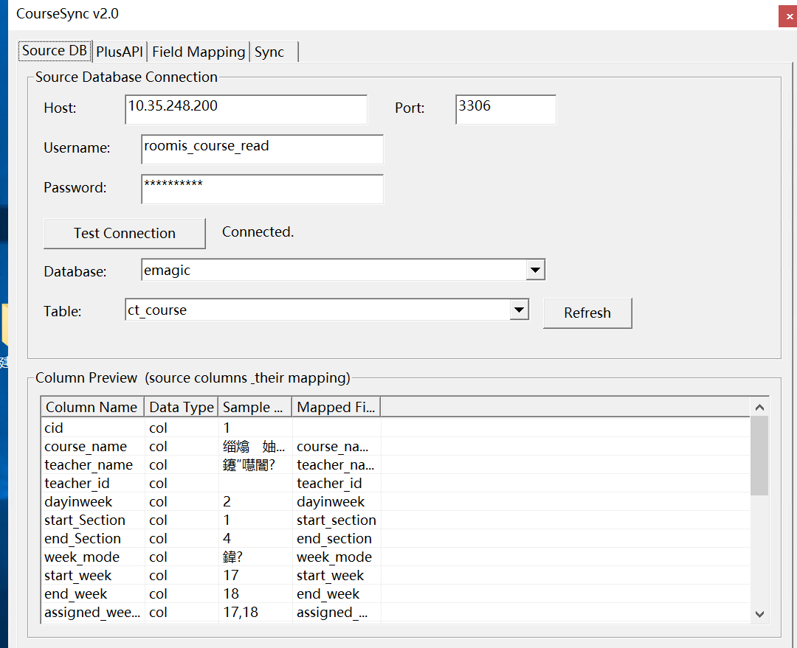

# CourseSync v2 — 课表同步中间件

面向 **vDisk 控制中心** 课表数据链路的桌面小工具：从校方自有 **MySQL 教务或选课库** 读取课表，映射为平台使用的 `ct_course` 结构，再 **写入目标库** 与/或 **HTTP 推送到 vDisk 控制中心**。它不替代控制台里的「课表导入」界面，而是解决 **库表结构各异、需要可重复、可定时同步** 时的衔接问题——源库换表、换字段时，用映射与预览把转换规则说清楚，减少手工 Excel 往返。

**说明（仅文档用语）**  
本 README 与仓库内 `INTEGRATION_SPEC.md` 将 HTTP 课表接收端统称为 **vDisk 控制中心**。**程序界面、运行日志、导出配置里仍可能出现「PlusAPI」**，为既有技术命名，与上述接收端指同一类目标（例如服务路径中的 `plusapi` 段），对接时以实际 URL 与接口文档为准。

**维护背景（与产品线的关系）**  
本模块由 **上海澄成信息技术有限公司**（微蝶 **vDisk**）相关交付与集成场景中使用：vDisk 侧已有课表导入、教室对应、详细课表查询，以及基于课表的 **智能运行 / 物联联动**（课前预热、无课巡检、下课关机等，均以课表计划为边界）。当客户课表落在 **自建教务库** 而非标准导入模板时，用 CourseSync 把数据 **对齐到同一套 `ct_course` 语义**，再进入现有链路。能力边界以你方部署的 vDisk 控制中心 与数据库版本为准；仓库内仅提供工具与说明，**商业授权与技术支持仍走正规商务与交付渠道**。

更完整的产品与手册索引见帮助中心仓库：[澄成软件 · 用户手册](https://help.os-v.com)（课表相关章节如：课表导入、课表联动等，与控制台操作对应）。



**联系（与手册一致）**  
企业微信客服见手册首页「在线咨询与购买」；邮件 **aaron@newvhd.com**；微信号 **okstop88**。  

---

## 对接与开发建议（导出 SQL + Cursor，或截图）

交付现场表结构千差万别时，建议先把**结构说清楚**，再用 **Cursor** 辅助写映射说明、核对字段、或改 **vDisk 控制中心** 侧接收逻辑——不必手写长文档。

### 1. 先把「目标」结构固定下来

在 **写入课表的目标 MySQL** 上执行（表名以你环境为准，一般为 `ct_course`）：

```sql
SHOW CREATE TABLE ct_course\G
```

把输出里的 **完整建表语句** 复制保存为 `ct_course.sql`（或贴进记事本）。若有视图/关联表也要对接，可同样导出 `SHOW CREATE TABLE …`。  
这一步的意义：后续无论是自己填 Tab3 映射，还是让 AI 对照，都以**同一套目标列**为准，避免口头描述和真实库不一致。

### 2. 准备「来源」侧材料（文字或截图均可）

至少要有：

- 来源课表所在 **库名、表名**；
- **列名列表**（`DESCRIBE 你的课表名` 或客户端「表结构」一页）；
- **2～5 行真实样例**（可脱敏），或 **Navicat / DMS / phpMyAdmin 的数据网格截图**。

**给 Cursor 的方式可以二选一（或组合）：**

| 方式 | 做法 |
|------|------|
| **文本** | 把 `SHOW CREATE TABLE ct_course`、来源表 `DESCRIBE`、样例 `SELECT … LIMIT 5` 贴进对话 |
| **截图** | 截「表结构」页（列名、类型）、再截「数据样例」页；**或**截 CourseSync 里 Tab1 列出的列名、Tab3 映射界面。多图时按 Tab1→Tab3→接口说明顺序发，并一句话说明哪张图是来源、哪张是目标 |

截图对 Cursor 同样有效：模型能读列名与界面上的标签，适合不方便导出 SQL 的环境。

### 3. 用 Cursor 打开本工程

在 Cursor 中选 **文件 → 打开文件夹**，指向本仓库根目录（含 `CourseSync.sln` / 源码与 `README.md`）。把 `ct_course.sql` 拖进工程旁工作区或直接贴进 Composer/Chat 即可，不必改代码也能对话。

### 4. 可复制提示词示例（按需改括号里的内容）

下面整段粘贴到 Cursor，替换括号内容即可：

```
我在做 CourseSync 课表同步对接。

【目标】下面是目标表 ct_course 的建表 SQL：
（粘贴 SHOW CREATE TABLE 结果）

【来源】教务课表在库（库名）、表（表名）。来源列如下：
（粘贴 DESCRIBE 或列清单；若用截图则说明「见上一张/下一张截图」）

请对照 CourseSync README 里的 ct_course 字段含义与单双周规则，帮我：
1）列出来源列 → ct_course 的映射建议表；
2）标出无法直接映射、需要常量/公式/忽略的列；
3）若 week_mode、周次在来源里是别的编码，说明应在 Tab3 怎么填或是否要改来源视图。

不要改我仓库代码，只输出映射表与注意事项。
```

若你要改 **vDisk 控制中心** 接收逻辑，把接口路径、请求体示例（或 Swagger 截图）一并附上，并说明「包装键是否用 data」。

### 5. 程序内完整使用顺序（建议按此做）

1. **Tab1 · 来源数据库**  
   填 MySQL 连接 → 测试连接 → 选择 **来源课表**。确认列名与样例与现场一致。

2. **Tab2 · 目标与 vDisk 控制中心**  
   - 配置 **目标库**（写入 `ct_course` 的实例；若与来源同一台可勾选复用连接）。  
   - 若需要 HTTP 推送：填 **Base URL、路径、Token、POST/PUT、包装键**（与 vDisk 控制中心 实现一致）。

3. **Tab3 · 字段映射**  
   左列来源列名，右列选 `ct_course` 字段；点 **预览转换结果** 核对周次、节次、教室等是否合理。

4. **Tab4 · 同步与定时**  
   先 **立即同步** 小范围验证；再按需开 **定时**，需要后台跑时最小化到托盘。

5. **验收**  
   目标库 `SELECT` 抽查；若配了 vDisk 控制中心，在接收端日志或 DB 中确认批次与条数。

---

## 数据流向

```
来源 MySQL 数据库
  └─ 选择来源课表（任意表）
        │
        │  字段映射（来源列名 → ct_course字段）
        │  单双周计算（全/单/双 → assigned_weeks / all_weeks）
        ▼
  ┌─────────────────────────────────┐
  │  转换后的 CtCourse 数据          │
  └─────────────────────────────────┘
        │                   │
        ▼                   ▼
  目标 MySQL           vDisk 控制中心 端点
  ct_course 表     （你在 vDisk 控制中心 中新建的接口）
  （upsert）        Bearer Token 认证推送
```

**来源库**（你自己的选课/教务系统 MySQL）→ 读取任意课表  
**vDisk 控制中心**（接收端）→ 程序将转换好的数据 POST 过去，vDisk 控制中心 正常对外提供  
**来源可以随时变更**，每次同步都重新读取、转换、写入/推送

---

## 四个功能标签页

### Tab1：来源数据库
- 配置来源 MySQL（主机/端口/库名/用户密码）
- 测试连接后选择来源课表
- 自动展示来源表列名和示例值（辅助配置字段映射）

### Tab2：目标与 vDisk 控制中心
- **目标库**：写入 `ct_course` 的 MySQL，可与来源库相同（勾选后直接复用连接）
- **vDisk 控制中心 推送配置**（可配多个）：
  - Base URL：vDisk 控制中心 服务地址
  - 接口路径：你在 vDisk 控制中心 中新建的 API 路径（如 `/api/course/sync`）
  - API Token：已有的 Bearer Token（程序自动加 `Bearer ` 前缀）
  - 请求方式：POST 或 PUT
  - 数据包装键：如填 `data` 则发送 `{"data":[...]}` ；留空则直接发 JSON 数组

### Tab3：字段映射
- 左列填来源表的列名，右列选映射到的 ct_course 字段
- 内置 80+ 常见命名风格默认映射（教务系统中文缩写、驼峰、下划线均支持）
- 点「预览转换结果」可实时查看来源数据转换后的效果

### Tab4：同步与定时
- **立即同步**：手动触发完整流程
- **定时自动同步**：设置间隔（分钟/小时/天），开启后最小化到系统托盘后台运行
- 关闭窗口时若定时任务启用，自动最小化到托盘而不退出

---

## 单双周处理

| `week_mode` 值 | 含义 | 生成的 `assigned_weeks` 示例 |
|---|---|---|
| `全` / `all` / `0` | 每周都有 | `1,2,3,4,5,6,7,8` |
| `单` / `odd` / `1` | 单周（奇数周） | `1,3,5,7,9,11,13,15` |
| `双` / `even` / `2` | 双周（偶数周） | `2,4,6,8,10,12,14` |

来源表若已有 `assigned_weeks` 列则直接使用；  
若只有 `start_week`/`end_week`/`week_mode` 则自动推算。

---

## 本地更新策略

匹配优先级（勾选「优先用 course_id 匹配」时）：
1. `course_id` 精确匹配 → **UPDATE**（更新除 cid/create_time 外所有字段）
2. `course_name + teacher_code + dayinweek + start_section + room_id` 组合匹配 → **UPDATE**
3. 无匹配 → **INSERT**（新增，自动设置 create_time）

---

## vDisk 控制中心 推送格式

程序将所有转换结果序列化为 JSON 后分批（每批 200 条）POST 到配置的端点：

```json
POST /api/course/sync
Authorization: Bearer <your_token>
Content-Type: application/json

{
  "data": [
    {
      "course_name": "Python程序设计基础",
      "teacher_name": "常青青",
      "dayinweek": 3,
      "start_section": 1,
      "end_section": 2,
      "week_mode": "全",
      "start_week": 1,
      "end_week": 15,
      "assigned_weeks": "1,2,3,4,5,6,7,8,9,10,11,12,13,14,15",
      "all_weeks": "#1#2#3#4#5#6#7#8#9#10#11#12#13#14#15#",
      "room_name": "7f706",
      ...
    }
  ]
}
```

---

## 编译

```
build.bat    （Qt 5.5.1 + MSVC2013 32位，与项目现有环境一致）
```

依赖：`qsqlmysql.dll`（MySQL Qt 驱动）+ `libmysql.dll`（MySQL C Connector）

---

## 许可与声明

若本仓库未附带 `LICENSE`，则默认不授予对源码或文档的商业再分发许可；欢迎通过 Issue 反馈问题。文档表述与现场部署不一致时，以实际合同与交付说明为准。
